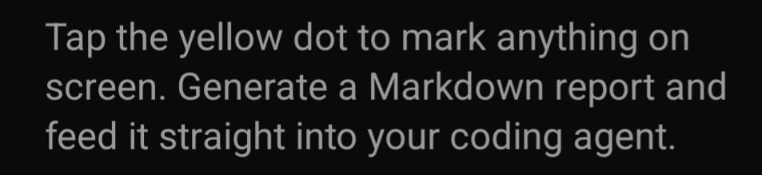

# Nokta Audit Report

- _Report ID:_ r_mpayyfdc_4nqr
- _Screen:_ /
- _Captured:_ 5/18/2026, 11:55:43 AM (2026-05-18T08:55:43.440Z)
- _Device:_ android 36 — 384×832
- _Annotations:_ 1

---

## Finding 1

- _Region:_ x=16, y=232, w=320, h=71
- _Note:_ Renk kontrastı çok düşük

---

## Visual Layout

................................
................................
................................
................................
................................
................................
.AAAAAAAAAAAAAAAAAAAAAAAAAAAA...
.A..........................A...
.AAAAAAAAAAAAAAAAAAAAAAAAAAAA...
................................
................................
................................
................................
................................
................................
................................
................................
................................
................................
................................
................................
................................
................................
................................

## Agent Instructions

Use the _READ → LOCATE → HYPOTHESIZE → REPAIR → TEST → VERIFY → COMMIT/ROLLBACK_ loop.
Each annotated finding is an independent issue. Address them in order.
