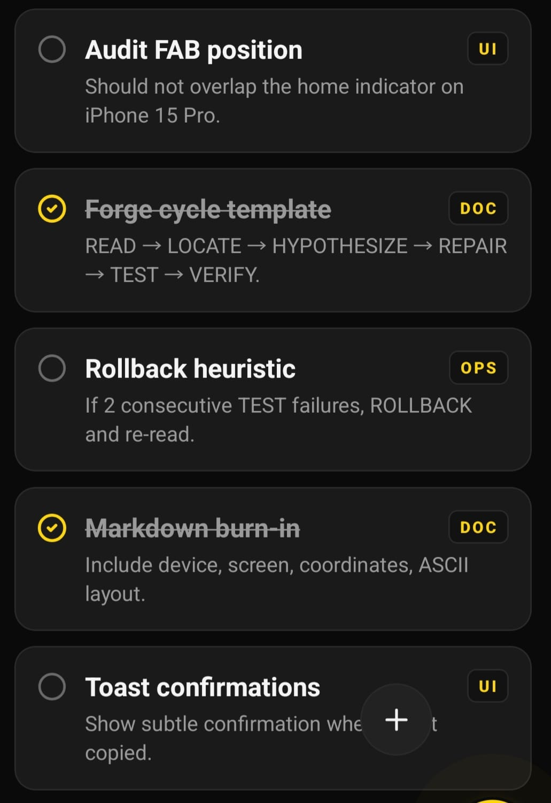

# Nokta Audit Report

- _Report ID:_ r_mpazh7ug_85n2
- _Screen:_ /notes
- _Captured:_ 5/18/2026, 12:10:20 PM (2026-05-18T09:10:20.152Z)
- _Device:_ android 36 — 384×832
- _Annotations:_ 1

---

## Finding 1

- _Region:_ x=18, y=162, w=304, h=516
- _Note:_ Liste çalışmıyor

---

## Visual Layout

................................
................................
................................
................................
.AAAAAAAAAAAAAAAAAAAAAAAAAA.....
.A........................A.....
.A........................A.....
.A........................A.....
.A........................A.....
.A........................A.....
.A........................A.....
.A........................A.....
.A........................A.....
.A........................A.....
.A........................A.....
.A........................A.....
.A........................A.....
.A........................A.....
.A........................A.....
.AAAAAAAAAAAAAAAAAAAAAAAAAA.....
................................
................................
................................
................................

## Agent Instructions

Use the _READ → LOCATE → HYPOTHESIZE → REPAIR → TEST → VERIFY → COMMIT/ROLLBACK_ loop.
Each annotated finding is an independent issue. Address them in order.
