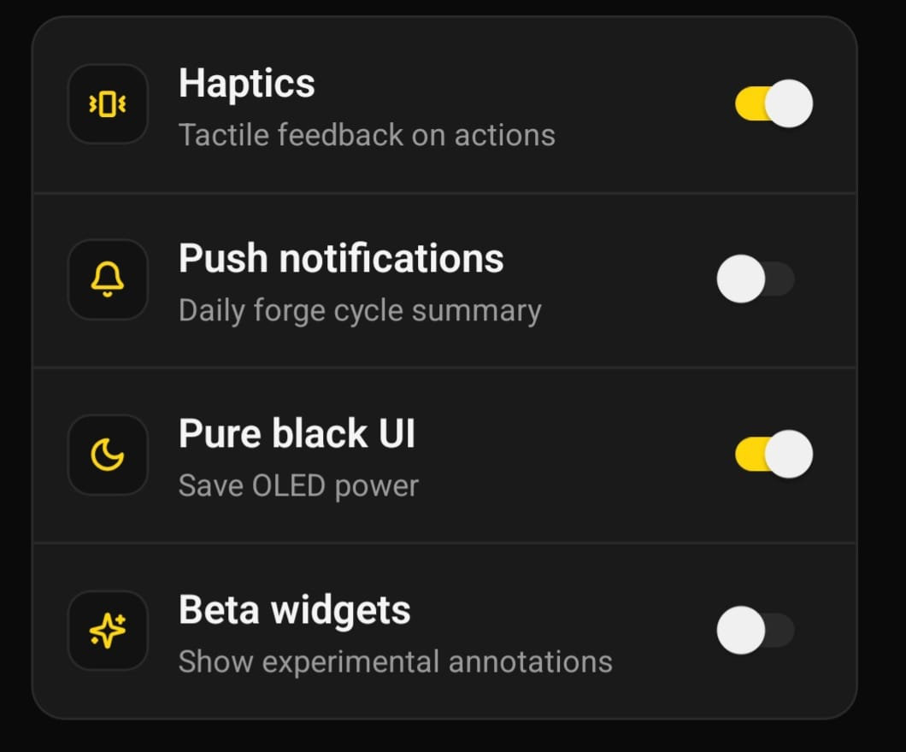

# Nokta Audit Report

- **Report ID:** `r_mpazidit_pino`
- **Screen:** `/settings`
- **Captured:** 5/18/2026, 12:11:14 PM (`2026-05-18T09:11:14.165Z`)
- **Device:** android 36 — 384×832
- **Annotations:** 1



---

## Finding 1

- **Region:** x=10, y=138, w=370, h=347
- **Note:** Preferences kısmındaki butonlar çalışmıyor l.

---

## Visual Layout

```
................................
................................
................................
AAAAAAAAAAAAAAAAAAAAAAAAAAAAAAAA
A..............................A
A..............................A
A..............................A
A..............................A
A..............................A
A..............................A
A..............................A
A..............................A
A..............................A
AAAAAAAAAAAAAAAAAAAAAAAAAAAAAAAA
................................
................................
................................
................................
................................
................................
................................
................................
................................
................................
```

## Agent Instructions

Use the **READ → LOCATE → HYPOTHESIZE → REPAIR → TEST → VERIFY → COMMIT/ROLLBACK** loop.
Each annotated finding is an independent issue. Address them in order.
