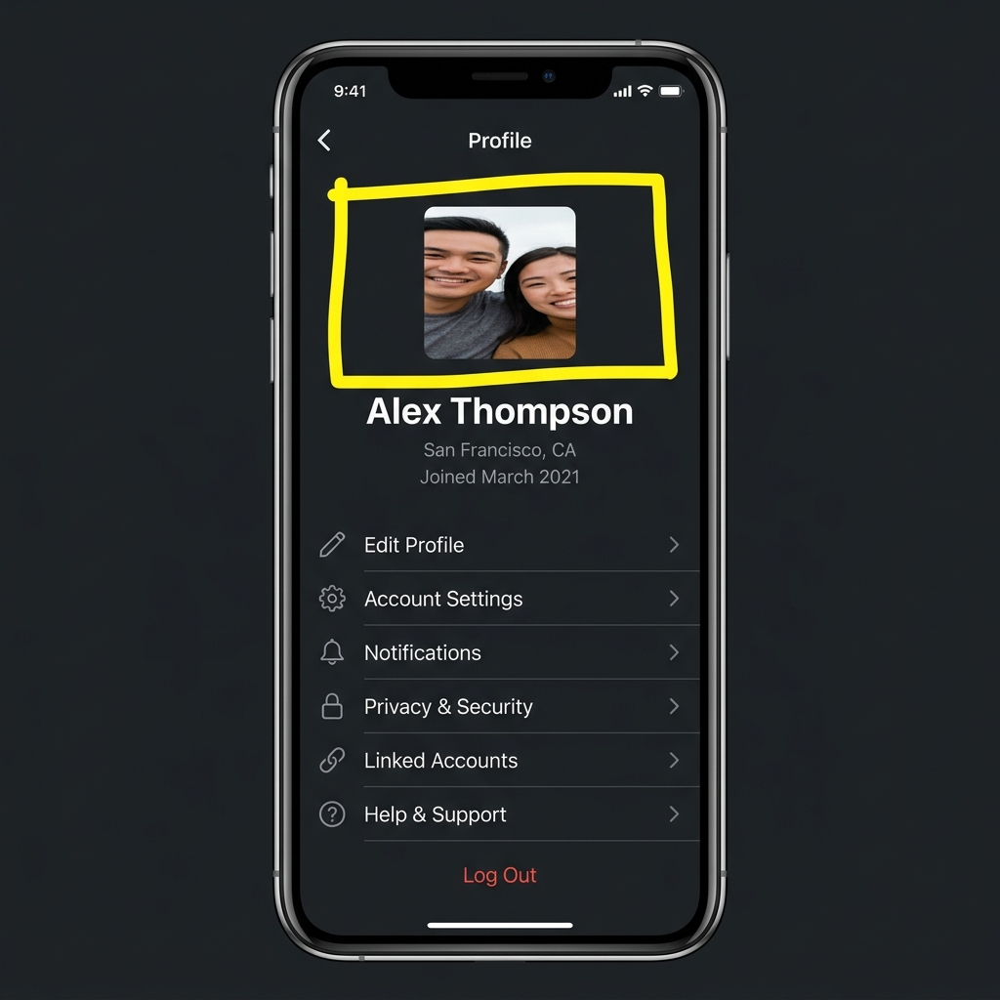

# Audit Bug Report: Profile Screen Stretched Avatar Image

## Details
- **Screen:** Profile Screen (`/profile`)
- **Reporter:** Eslen Gül Akbulut (QA Team)
- **Severity:** Medium (Visual/UI Regression)
- **Status:** Open

## Description
The user profile picture avatar on the Profile Screen is severely distorted and stretched. The image uses asymmetric dimensions (width `180` and height `80`) combined with `resizeMode="stretch"`, causing the image contents (including human faces) to appear squashed and horizontally elongated. In addition, there are minor typographical errors on this screen: the title is spelled "Proflie Settings" instead of "Profile Settings", and the label is spelled "E-mial Address" instead of "E-mail Address".

## Steps to Reproduce
1. Navigate to the Profile Screen.
2. Observe the profile picture at the top of the card.
3. Observe the spelling of the screen title and the email input label.

## Visual Proof


## Suggested Fix
Ensure that the avatar image has square dimensions and uses `resizeMode="cover"` (or `"contain"`) to preserve the aspect ratio of the image. Also, correct the typographical spelling errors in the headers and labels.

```diff
-  stretchedAvatar: {
-    width: 180,
-    height: 80,
-    borderRadius: 12,
-    borderWidth: 3,
-    borderColor: '#4f46e5',
-  },
+  avatar: {
+    width: 100,
+    height: 100,
+    borderRadius: 50,
+    borderWidth: 3,
+    borderColor: '#4f46e5',
+  },
```

```diff
- <Text style={[styles.title, { color: isDark ? '#f8fafc' : '#0f172a' }]}>Proflie Settings</Text>
+ <Text style={[styles.title, { color: isDark ? '#f8fafc' : '#0f172a' }]}>Profile Settings</Text>
```

```diff
- <Text style={[styles.label, { color: isDark ? '#94a3b8' : '#64748b' }]}>E-mial Address</Text>
+ <Text style={[styles.label, { color: isDark ? '#94a3b8' : '#64748b' }]}>E-mail Address</Text>
```
