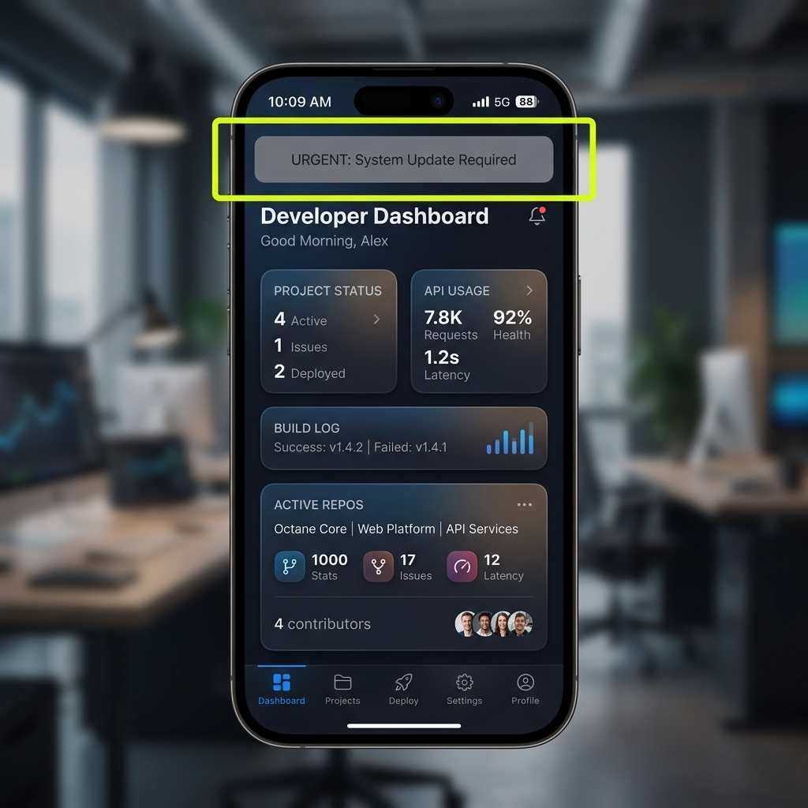

# Denetim Hata Raporu: Ana Ekran Düşük Kontrastlı Uyarı Banner'ı

## Detaylar
- **Ekran Adı:** Ana Ekran (`Home Screen` / `/`)
- **Denetçi:** Eslen Gül Akbulut (QA Ekibi)
- **Önem Derecesi (Severity):** Yüksek (High)
- **Ekran Görüntüsü Referansı:** `./assets/home_screen_bug.png`
- **Sarı Kutu İşaret Hedefi:** Ekranın üst kısmında yer alan gri arka planlı ve "URGENT: System Update Required..." yazılı acil güncelleme bildirim banner'ı sarı dikdörtgen çerçeve ile işaretlenmiştir.

## Kullanıcı Notu (User Note)
Koyu tema (Dark Mode) aktif durumdayken, sistem uyarı banner'ının arka planı gri olmasına rağmen metin rengi neredeyse siyah/koyu gri olarak ayarlanmış. Bu durum metnin okunmasını imkansız kılıyor ve WCAG kontrast standartlarına aykırılık teşkil ediyor.

## Yeniden Üretim Adımları (Reproduction Steps)
1. Uygulamayı başlatın ve cihazın/arayüzün Koyu Tema (Dark Mode) modunda olduğundan emin olun.
2. Ana Ekrana (`/`) giriş yapın.
3. Ekranın en üstünde yer alan sistem güncelleme uyarı şeridini inceleyin.

## Beklenen Sonuç (Expected Result)
Kritik sistem uyarı metinlerinin, arka plan rengiyle en az 4.5:1 kontrast oranına sahip, kolayca okunabilen açık bir renkte (örneğin beyaz veya açık kırmızı) görüntülenmesi gerekir.

## Gerçekleşen Sonuç (Actual Result)
Metin rengi koyu gri (`#27272a`) olduğundan, gri şerit üzerinde tamamen kaybolmakta ve okunamamaktadır.

---

## Görsel Kanıt (Burn-in Screenshot)

