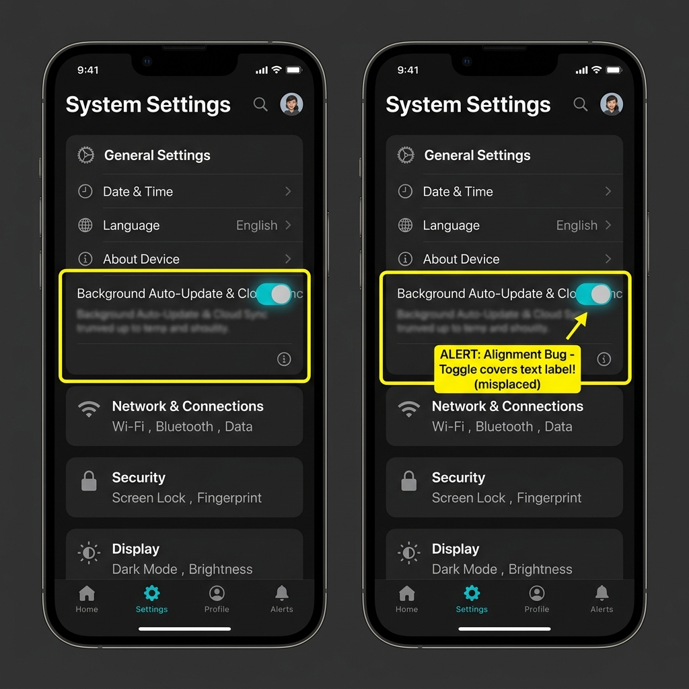

# Denetim Hata Raporu: Ayarlar Ekranı Eleman Çakışması ve Buton Engelleme Hatası

## Detaylar
- **Ekran Adı:** Ayarlar Ekranı (`Settings Screen` / `/settings`)
- **Denetçi:** Eslen Gül Akbulut (QA Ekibi)
- **Önem Derecesi (Severity):** Yüksek (High)
- **Ekran Görüntüsü Referansı:** `./assets/settings_screen_bug.png`
- **Sarı Kutu İşaret Hedefi:** Genel Ayarlar altındaki switch toggle butonunun, kendi seçeneğinin metniyle ("Background Auto-Update & Cloud Sync") çakıştığı ve üzerine bindiği alan sarı dikdörtgen çerçeve ile işaretlenmiştir.

## Kullanıcı Notu (User Note)
Ayarlar sayfasında iki adet yerleşim hatası mevcuttur:
1. Otomatik güncelleme seçeneğine ait geçiş anahtarı (switch), metinle hizalanmak yerine absolute konumlandırma hatası yüzünden metnin üzerine biniyor.
2. Alttaki "Reset All Data" kırmızı butonu mutlak konumlandırma nedeniyle "Privacy Policy" satırının tam üstüne oturarak bu linke tıklanmasını engelliyor.

## Yeniden Üretim Adımları (Reproduction Steps)
1. Alt navigasyon menüsünden "Settings" sekmesine tıklayın.
2. "General Settings" altındaki "Background Auto-Update & Cloud Sync" satırına ait Switch butonunun duruşunu gözlemleyin.
3. Alt kısımdaki "Information" kartını inceleyerek kırmızı "Reset All Data" butonunun altındaki satırı kapatıp kapatmadığını kontrol edin.

## Beklenen Sonuç (Expected Result)
Switch kontrolünün metnin sağ ucunda, metne dokunmayacak şekilde konumlandırılması ve "Reset All Data" butonunun kartın normal alt akışı içerisinde yer alarak diğer tıklanabilir ayarları (Privacy Policy) örtmemesi gerekir.

## Gerçekleşen Sonuç (Actual Result)
Switch butonu metnin üzerine binerek okunurluğu ve tıklamayı bozmaktadır. Sıfırlama butonu ise Gizlilik Politikası satırının z-index olarak üstünde durarak ilgili linkin tıklanmasını tamamen engellemektedir.

---

## Görsel Kanıt (Burn-in Screenshot)

