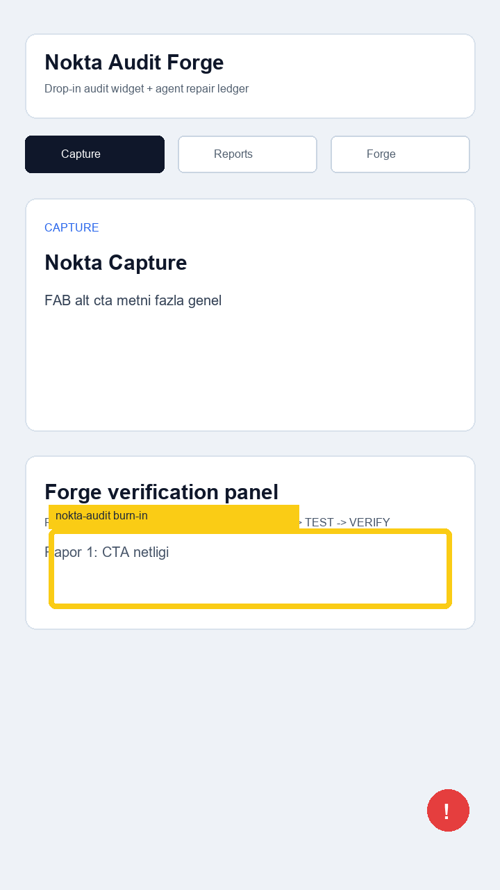

# Audit Report 01 - Capture CTA

**App:** Nokta Audit Forge  
**Screen:** Capture  
**Reporter:** 231118040  
**Status:** open  
**Timestamp:** 2026-05-14T12:10:00+03:00



## Customer note

FAB ile rapor almayi gosteren Capture ekraninda alt aksiyon metni fazla genel. Tester, ilk kullanimda
"bu butona basinca rapor mu olusuyor yoksa sadece ekran mi degisiyor" ayrimini anlayamiyor.

## Selection bounds

```json
{"x":70,"y":760,"width":580,"height":115}
```

## Agent input

READ -> Capture ekranindaki aksiyon metni incelenecek.  
LOCATE -> `app/src/screens.ts` icindeki Capture kopyasi ve metric paneli.  
Expected repair -> Microcopy daha somut hale getirilecek.
