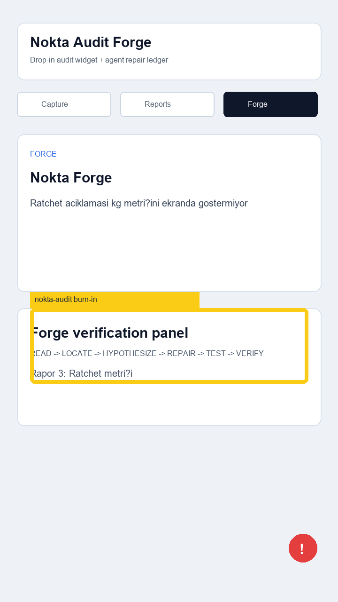

# Audit Report 03 - Forge Ratchet

**App:** Nokta Audit Forge  
**Screen:** Forge  
**Reporter:** 231118040  
**Status:** open  
**Timestamp:** 2026-05-14T12:39:00+03:00



## Customer note

Forge ekraninda 3 success + 1 rollback yaziyor ama kg ratchet artisi ekranda sayisal gorunmuyor.
Track A icin bile ledger ve ekran arasinda daha net bag kurulmali.

## Selection bounds

```json
{"x":64,"y":655,"width":592,"height":160}
```

## Agent input

READ -> Forge panelindeki ratchet metni ve metric degeri incelenecek.  
LOCATE -> `app/src/screens.ts` Forge screen config.  
Expected repair -> kg metrigi ekran metnine ve FORGE ledger'a tutarli sekilde eklenecek.
