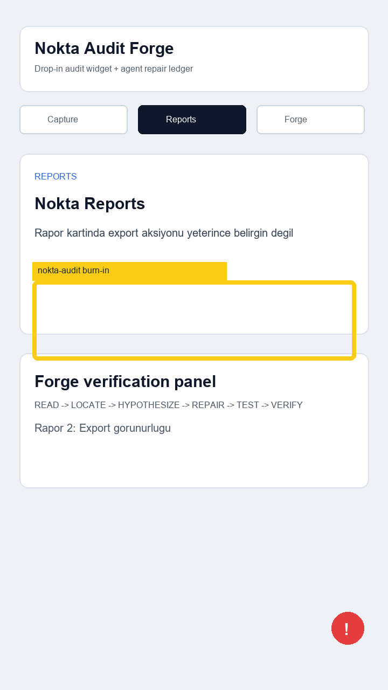

# Audit Report 02 - Reports Export

**App:** Nokta Audit Forge  
**Screen:** Reports  
**Reporter:** 231118040  
**Status:** open  
**Timestamp:** 2026-05-14T12:24:00+03:00



## Customer note

Reports ekraninda Markdown export'un coding agent input'u oldugu acik degil. Musteri raporu paylasacak
mi, agent'a mi verecek, yoksa lokal arsiv mi yapacak emin olamiyor.

## Selection bounds

```json
{"x":60,"y":520,"width":600,"height":148}
```

## Agent input

READ -> Reports ekranindaki export anlatimi incelenecek.  
LOCATE -> `app/src/screens.ts` Reports screen body metni.  
Expected repair -> Export hedefi "Markdown input for agent" olarak netlestirilecek.
