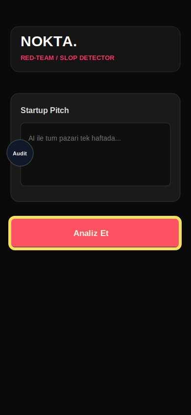

# Bug Raporu - SlopDetec

**Tarih:** 18.05.2026 14:10  
**Toplam:** 1 not - 1 acik - 0 duzeltildi

---

## Ekran: Analyzer

### #1 - Analiz butonu fazla baskin

- **Durum:** Acik
- **Zaman:** 18.05.2026 14:10
- **Raporlayan:** 231118044-codex-loop
- **Secim:** x=20, y=442, w=348, h=64

## Musteri notu

Analiz Et butonu ekranin geri kalanindan cok daha agir duruyor. Due diligence urunu gibi sakin, profesyonel ve tekrar kullanilabilir bir komut olmali.
