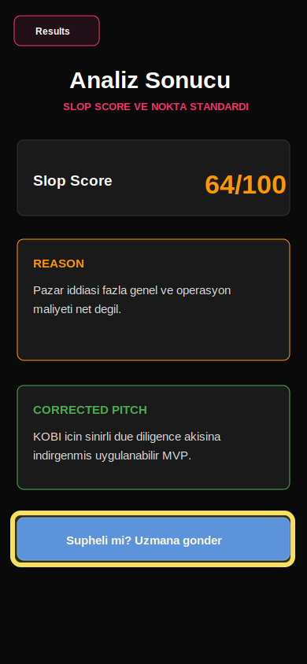

# Bug Raporu - SlopDetec

**Tarih:** 18.05.2026 14:24  
**Toplam:** 1 not - 1 acik - 0 duzeltildi

---

## Ekran: Results

### #1 - Uzman gonderme feature istegi daha net olmali

- **Durum:** Acik
- **Zaman:** 18.05.2026 14:24
- **Raporlayan:** 231118044-codex-loop
- **Secim:** x=16, y=652, w=356, h=66

## Musteri notu

Bu bolge sadece mailto aciyor gibi duruyor. Musteri-gelistirici modunda bu butonun "neden insan onayi gerekiyor" bilgisini de kullaniciya hissettirmesi lazim.
