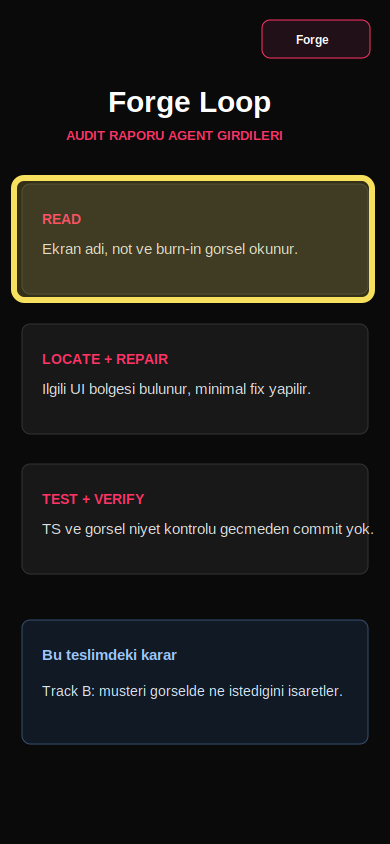

# Bug Raporu - SlopDetec

**Tarih:** 18.05.2026 14:41  
**Toplam:** 1 not - 1 acik - 0 duzeltildi

---

## Ekran: Forge

### #1 - Forge ekrani agent dongusunu gostermeli

- **Durum:** Acik
- **Zaman:** 18.05.2026 14:41
- **Raporlayan:** 231118044-codex-loop
- **Secim:** x=14, y=178, w=358, h=122

## Musteri notu

Bu ekran sadece aciklama gibi kalmamali. READ, LOCATE, REPAIR, TEST ve VERIFY adimlari musteri raporundan agent isine nasil aktigini gostersin.
