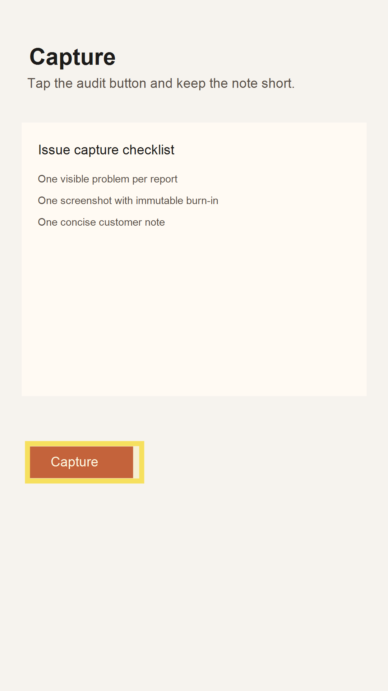

# Audit Report: Capture CTA

- Screen name: `/`
- Customer note: "The first screen needs a more direct capture instruction."
- Selection bounds: `{ "x": 76, "y": 1232, "width": 318, "height": 104 }`

## Agent input

Read the highlighted capture action, locate the copy source, and make the smallest wording change that reduces hesitation without changing layout or widget behavior.

