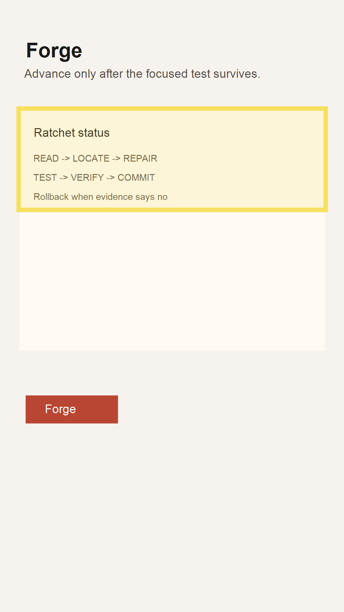

# Audit Report: Forge Ratchet

- Screen name: `/forge`
- Customer note: "Show what the next ratchet step is before I read the whole ledger."
- Selection bounds: `{ "x": 58, "y": 340, "width": 964, "height": 318 }`

## Agent input

Locate the forge status copy and expose the next repair step in one short sentence while preserving the simple three-screen structure.

