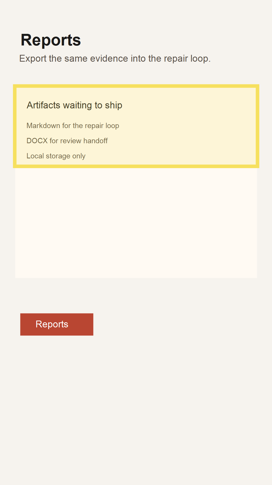

# Audit Report: Reports Export

- Screen name: `/reports`
- Customer note: "Export is available, but the flow should be understandable at a glance."
- Selection bounds: `{ "x": 58, "y": 340, "width": 964, "height": 318 }`

## Agent input

Review the reports copy, keep the UI sparse, and explain the export flow with one concise sentence instead of adding duplicate controls.

