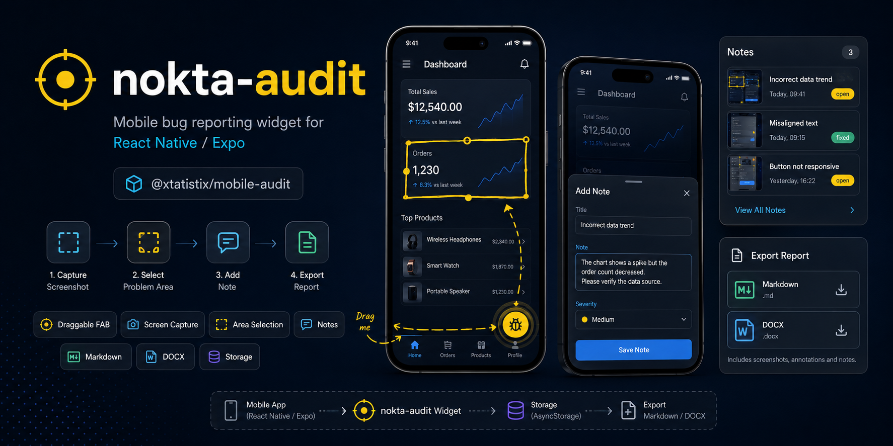

# 🐛 nokta-audit



> `@xtatistix/mobile-audit` — React Native / Expo uygulamalarına gömülen **drop-in bir bug-raporlama primitif'i**.

Sürüklenebilir bir FAB üzerinden ekranı yakalar, sorunlu alanı parmakla işaretletir, notu insan dilinde tutar ve Markdown / Word artifakta çevirir. Backend yok, hesap yok, telemetri yok — host uygulamanın kararıyla yaşar, host uygulamanın depolama mekanizmasıyla çalışır.

**Çekirdek vaat:** bug görme anı ile bug raporlanma anı arasındaki sürtünmeyi saniyelere indirmek; aynı raporu hem insanın paylaşabileceği hem coding agent'ın onarımda kullanabileceği bir format'ta üretmek. Mobilde insan gözünün yakaladığı UX hataları, ek bir SaaS aboneliği veya backend bağımlılığı olmadan, host uygulamanın kendi paylaşım kanallarından dışarı verilir — paylaşımın hedefi de WhatsApp olabilir, Slack olabilir, doğrudan bir Claude Code / Codex komutu olabilir.

> Bu paketin **neden** bu şekilde tasarlandığını anlamak için → [`IDEA.md`](./IDEA.md). README pratik kullanım ve API referansıdır; `IDEA.md` örüntü, sınırlar ve kristalize kararlar dokümanıdır.

---

## Ne olduğu ve ne olmadığı

**Bu paket:**
- React Native / Expo uygulamalarının kök ağacına tek bileşen olarak düşen bir bug-raporlama widget'ı
- Görsel bağlamı (screenshot + sarı seçim kutusu) **immutable burn-in** ile yakalar
- Notları host uygulamanın seçtiği storage'da yerel olarak tutar
- Çıktıyı insan-okur, paket-bağımsız artifakt'a (`.md` / `.docx`) çevirir

**Bu paket değildir:**
- Sentry alternatifi değil (crash reporter değil — UX bug reporter)
- Instabug / BugHerd / Shake gibi SaaS bug platformu değil (backend yok)
- Linear / Jira / GitHub Issues yerine geçmez (issue tracker değil)
- Detox / Maestro yerine geçmez (test automation değil)
- Analytics SDK'sı değil

---

## Özellikler

| Özellik | Açıklama |
|---|---|
| 🐛 **Sürüklenebilir FAB** | Ekranda serbestçe konumlandırılabilen tek görünür yüzey — tek dokunuş ekran yakala, çift dokunuş not listesi |
| 📸 **Ekran Görüntüsü Yakalama** | Host'un sağladığı `captureScreen` üzerinden anlık görüntü |
| 🎯 **Burn-in Alan Seçimi** | Parmakla sarı kutu çiz; composite view yeniden capture edilir ve seçim görüntünün **immutable** parçası olur |
| 📝 **Not Ekleme** | Bottom-sheet overlay — ekran adı ve raporlayan otomatik meta olarak eklenir |
| 📋 **Not Yönetimi** | Kart görünümü, status takibi (🔴 açık / ✅ düzeltildi), inline düzenleme, silme |
| 📤 **Markdown Artifact** | Ekran bazlı gruplanmış, status'lu, emoji destekli `.md` raporu — insan paylaşımı **ve** coding agent input'u için optimize edilmiş |
| 📄 **Word Artifact** | Profesyonel `.docx` raporu — ekran görüntüleri gömülü, aspect ratio korunur |
| 🤖 **Coding Agent Ready** | `.md` çıktısı doğrudan Claude Code / Codex / OpenCode gibi geliştirici ajanlarına auto-repair loop input'u olarak verilebilir |
| 🔁 **Composability** | `currentScreen` host router'dan beslenir; ek state işaretçileri (örn. `tourStepId`) ile tour-agent gibi modüllerle bidirectional replay açılabilir |
| 💾 **Storage Soyutlaması** | `AuditStorage` interface — host AsyncStorage / MMKV / SQLite / custom seçer |
| 🔌 **Dependency Injection** | Native yetenekler (capture, write, share) host'tan `deps` üzerinden gelir; widget native paket import etmez |
| 🔒 **No Backend** | Uzak servise veri gitmez — host'un share-sheet'i tek dışa çıkış noktasıdır |

---

## Drop-in prensibi

Widget iki disiplinle çalışabilir:

**Self-contained mod.** Tek `<AuditWidget />` mount edilir, host'un geri kalanını bilmeden çalışır. Beş dakikalık kurulum, çalışan bug raporlama akışı.

**Composed mod.** Host uygulama widget'ı kendi pipeline'ına bağlar — `currentScreen`'i router middleware'inden, `reporterId`'yi auth state'inden besler, export sonrası kendi Slack webhook'una push eder, status'u kendi issue-tracker'ından senkronize eder. Widget kontratı bozulmaz; üzerine birikim eklenir.

**Host application boundary.** Widget host'un navigation'ına, auth'una, analytics'ine müdahale etmez. Sadece pasif prop'ları okur ve `deps` üzerinden host'tan istediği şeyleri ister. Bu sınırın korunması drop-in vaadinin temelidir.

---

## Mimari

```
src/
├── index.ts                        # Public API — barrel export
├── core/                           # ── Çekirdek (saf TypeScript, React-bağımsız)
│   ├── types.ts                    # AuditNote, AuditNoteBounds, AuditReportMeta, AuditStorage
│   └── storage.ts                  # NoteManager (CRUD), generateId
├── components/                     # ── Orchestrator + UI bileşenleri
│   ├── AuditWidget.tsx             # Orchestrator — FAB + state machine + deps yönetimi
│   ├── AuditSelector.tsx           # Tam ekran alan seçici — PanResponder + composite burn-in
│   ├── AuditOverlay.tsx            # Not yazma bottom-sheet
│   └── AuditNoteList.tsx           # Modal not listesi + CRUD + export butonları
└── export/                         # ── Artifact üretimi (saf fonksiyon)
    ├── markdown.ts                 # buildMarkdown(notes, meta) → string
    └── docx.ts                     # buildDocx(notes, meta) → Promise<base64>
```

### Üç katman

```
┌─────────────────────────────────────────────┐
│              AuditWidget (FAB)              │  ← Orchestrator
│  idle → capturing → selecting → annotating  │     (state machine + deps)
│                    ↕                        │
│                   list                      │
├─────────────┬───────────────┬───────────────┤
│ AuditSelector│ AuditOverlay │ AuditNoteList │  ← UI Bileşenleri
│  (burn-in)   │ (annotate)   │ (CRUD + export│     (tek sorumluluk, prop callback)
├─────────────┴───────────────┴───────────────┤
│   NoteManager (CRUD)  •  buildMd/buildDocx  │  ← Çekirdek + Artifact
├─────────────────────────────────────────────┤
│   AuditStorage (interface) + deps (DI)      │  ← Host application boundary
└─────────────────────────────────────────────┘
                      ↓
              [host application]
        (AsyncStorage / MMKV / FileSystem / Sharing)
```

Çekirdek katmanı (`core/` + `export/`) saf TypeScript'tir; React'tan ve React Native'den bağımsızdır. Test edilebilirliği ve değiştirilebilirliği koruyan budur.

---

## Kurulum

```bash
npm install @xtatistix/mobile-audit
```

### Peer Dependency'ler

| Paket | Min. Versiyon | Neden |
|---|---|---|
| `react` | ≥ 18 | Host React versiyonu |
| `react-native` | ≥ 0.73 | Host RN versiyonu |
| `expo-file-system` | ≥ 17 | `deps.writeFile` için (host implement eder) |
| `expo-sharing` | ≥ 11 | `deps.shareFile` için (host implement eder) |
| `react-native-view-shot` | ≥ 3 | `deps.captureScreen` / `captureRef` için (host implement eder) |

```bash
npx expo install expo-file-system expo-sharing react-native-view-shot
```

> Widget bu paketleri **doğrudan import etmez** — sadece host uygulamanın `deps` üzerinden bunları sağlayacağını varsayar. Drop-in prensibinin somut karşılığıdır.

---

## Kullanım (Self-contained mod)

### 1. Storage adaptörü

`AuditStorage` interface'ini host uygulamanızın depolama tercihinizle implement edin. AsyncStorage örneği:

```tsx
import AsyncStorage from '@react-native-async-storage/async-storage';
import type { AuditStorage, AuditNote } from '@xtatistix/mobile-audit';

const STORAGE_KEY = 'audit_notes';

export const auditStorage: AuditStorage = {
  async loadNotes(): Promise<AuditNote[]> {
    const raw = await AsyncStorage.getItem(STORAGE_KEY);
    return raw ? JSON.parse(raw) : [];
  },
  async saveNotes(notes: AuditNote[]): Promise<void> {
    await AsyncStorage.setItem(STORAGE_KEY, JSON.stringify(notes));
  },
};
```

MMKV, SQLite, in-memory mock — interface aynı kaldığı sürece her şey çalışır.

### 2. Widget'ı mount etme

```tsx
import React from 'react';
import { Text } from 'react-native';
import { captureScreen, captureRef } from 'react-native-view-shot';
import * as FileSystem from 'expo-file-system';
import * as Sharing from 'expo-sharing';
import { AuditWidget } from '@xtatistix/mobile-audit';
import { auditStorage } from './auditStorage';

export default function App() {
  return (
    <>
      {/* ... uygulamanızın geri kalanı ... */}

      <AuditWidget
        appName="MyApp"
        deps={{
          captureScreen: () => captureScreen({ format: 'png', result: 'tmpfile' }),
          captureRef: (ref) => captureRef(ref, { format: 'png', result: 'tmpfile' }),
          writeFile: async (filename, content) => {
            const uri = FileSystem.documentDirectory + filename;
            await FileSystem.writeAsStringAsync(uri, content);
            return uri;
          },
          writeFileBinary: async (filename, base64) => {
            const uri = FileSystem.documentDirectory + filename;
            await FileSystem.writeAsStringAsync(uri, base64, {
              encoding: FileSystem.EncodingType.Base64,
            });
            return uri;
          },
          shareFile: (uri) => Sharing.shareAsync(uri),
          storage: auditStorage,
          currentScreen: 'HomeScreen', // host router'dan dinamik beslenmeli
          reporterId: 'qa-team',       // opsiyonel
          BugIcon: <Text style={{ fontSize: 22 }}>🐛</Text>,
        }}
        initialPosition={{ bottom: 110, right: 16 }}
      />
    </>
  );
}
```

Hassas ekranlarda widget'ı koşullu render ile gizlemek host'un sorumluluğundadır:

```tsx
{!isOnSensitiveScreen && <AuditWidget ... />}
```

---

## Operasyonlar

Widget'ın iç operasyonel modeli (detay için → [IDEA.md § Operasyonlar](./IDEA.md)):

| Operasyon | Tetikleyici | Davranış |
|---|---|---|
| **Capture** | FAB tek dokunuş | `deps.captureScreen` çağrılır, görüntü URI alınır |
| **Select** | Tam ekran selector'da parmak hareketi | Sarı kutu çizilir, "Devam"da composite view yeniden capture edilir → **burn-in** |
| **Annotate** | Bottom-sheet açılır | Not metni yazılır, `NoteManager.add` ile storage'a düşer |
| **List + edit + delete** | FAB çift dokunuş | Modal liste; düzenleme yalnızca not metni için (görüntü ve seçim immutable) |
| **Export** | Liste ekranında MD / DOCX butonu | `buildMarkdown` / `buildDocx` çağrılır, host `writeFile*` ile diske yazar, `shareFile` ile sistem paylaşımı (hedef insan **veya** coding agent olabilir) |

---

## API Referansı

### `AuditWidget`

Orchestrator bileşen — FAB'ı, state machine'i ve alt bileşenleri yönetir.

```tsx
interface Props {
  deps: AuditWidgetDeps;
  appName?: string;                                    // Varsayılan: 'App'
  initialPosition?: { bottom: number; right: number }; // FAB başlangıç konumu
}
```

#### `AuditWidgetDeps`

Host application boundary'sinin somut sözleşmesi — widget bu bundle'ı bekler, host doldurur.

| Alan | Tip | Açıklama |
|---|---|---|
| `captureScreen` | `() => Promise<string>` | Ekran görüntüsü yakalar, URI döner |
| `captureRef` | `(ref) => Promise<string>` | Belirli bir View ref'ini yakalar (composite burn-in için) |
| `writeFile` | `(filename, content) => Promise<string>` | Metin dosyası yazar, URI döner |
| `writeFileBinary` | `(filename, base64) => Promise<string>` | Base64 ikili dosya yazar, URI döner |
| `shareFile` | `(uri) => Promise<void>` | Dosyayı sistem paylaşım diyaloğuyla açar |
| `storage` | `AuditStorage` | Not CRUD depolama adaptörü |
| `currentScreen` | `string` | Aktif ekran adı (host router'dan beslenir) |
| `reporterId` | `string?` | Opsiyonel — raporlayan kişi/takım kimliği |
| `BugIcon` | `ReactNode` | FAB üzerinde gösterilen ikon |

#### State machine

```
idle ──(tek dokunuş)──→ capturing ──→ selecting ──→ annotating ──→ idle
  │                                                                  ↑
  └──(çift dokunuş)──→ list ─────────────────────────────────────────┘
```

| Durum | Davranış |
|---|---|
| `idle` | FAB görünür, sürüklenebilir |
| `capturing` | Ekran görüntüsü alınıyor |
| `selecting` | Tam ekran selector açık — sorunlu alanı parmakla çiz |
| `annotating` | Bottom-sheet overlay — not yaz ve kaydet |
| `list` | Modal — tüm notları görüntüle, düzenle, sil, dışa aktar |

---

### Core Tipler

#### `AuditNote`

Bir bug raporunun atomik birimi.

```typescript
interface AuditNote {
  id: string;
  screenName: string;
  screenshot: string;           // Dosya URI veya base64 data URI
  screenshotAspect?: number;    // Yükseklik/genişlik oranı (DOCX render için)
  highlightBounds: AuditNoteBounds | null;
  note: string;
  status: AuditNoteStatus;      // 'open' | 'fixed'
  timestamp: string;            // ISO 8601
  reporterRole?: string;
  reporterId?: string;
}
```

#### `AuditNoteBounds`

```typescript
interface AuditNoteBounds {
  x: number;
  y: number;
  width: number;
  height: number;
}
```

#### `AuditReportMeta`

```typescript
interface AuditReportMeta {
  appName: string;
  exportedAt: string;           // ISO 8601
  totalNotes: number;
}
```

#### `AuditStorage`

Widget ile host arasındaki tek persistence sözleşmesi.

```typescript
interface AuditStorage {
  loadNotes(): Promise<AuditNote[]>;
  saveNotes(notes: AuditNote[]): Promise<void>;
}
```

---

### `NoteManager`

CRUD operasyonlarını yöneten sınıf. `AuditStorage` adaptörü üzerinden çalışır.

```typescript
const manager = new NoteManager(storage);

await manager.getAll();                    // Tüm notları getirir
await manager.add({ screenName, ... });    // Yeni not ekler (id, timestamp, status otomatik)
await manager.update(id, { note: '...' }); // Belirli alanları günceller
await manager.remove(id);                  // Notu siler
await manager.clear();                     // Tüm notları temizler
```

---

### Artifact üretimi

#### `buildMarkdown(notes, meta)`

Notları ekran bazlı gruplanmış Markdown'a çevirir. Saf fonksiyon — yan etkisi yoktur.

```typescript
import { buildMarkdown } from '@xtatistix/mobile-audit';

const md = buildMarkdown(notes, {
  appName: 'MyApp',
  exportedAt: new Date().toISOString(),
  totalNotes: notes.length,
});
```

**Çıktı formatı:**

```markdown
# Bug Raporu — MyApp

**Tarih:** 13.05.2026 22:30
**Toplam:** 3 not · 🔴 2 açık · ✅ 1 düzeltildi

---

## Ekran: HomeScreen

### 🔴 #1 — Buton tıklanmıyor


- **Durum:** Açık
- **Zaman:** 13.05.2026 22:30
- **Raporlayan:** qa-team
```

#### `buildDocx(notes, meta)`

Profesyonel Word artifact'ı üretir. Saf async fonksiyon — base64 döner; dosyaya yazma host sorumluluğundadır. Ekran görüntüleri `screenshotAspect` ile aspect-ratio korunarak gömülür.

```typescript
import { buildDocx } from '@xtatistix/mobile-audit';

const base64 = await buildDocx(notes, {
  appName: 'MyApp',
  exportedAt: new Date().toISOString(),
  totalNotes: notes.length,
});
// base64 string olarak .docx içeriği — host writeFileBinary + shareFile ile akıtır
```

---

## Bileşen detayları

### `AuditSelector`

Tam ekran alan seçici. `PanResponder` ile parmak hareketinden dikdörtgen seçim kutusu üretir; "Devam" basıldığında composite view (`compositeRef`) yeniden capture edilir.

- Ekran görüntüsü arka planda gösterilir
- Karanlık overlay ekran üzerine bindirilir
- Sarı (`#f6e05e`) kenarlıklı seçim kutusu çizilir
- Onaylanan seçim **composite view'in re-capture'ı** ile ekran görüntüsünün immutable parçası haline gelir (burn-in)
- Minimum seçim boyutu: 10×10 piksel (kaza dokunuş filtresi)

### `AuditOverlay`

Not yazma yüzeyi. Bottom-sheet tarzı modal.

- İşaretlenmiş ekran görüntüsü küçültülmüş önizleme (maks. 160px yükseklik), aspect-ratio korunur
- Önizlemede seçilen bölge kırmızı (`#e53e3e`) kenarlıkla yeniden gösterilir
- Ekran adı ve raporlayan bilgisi meta — değiştirilemez
- `KeyboardAvoidingView` desteği
- Boş not kabul edilmez

### `AuditNoteList`

Not listesi ve yönetim ekranı. Modal olarak tam sayfa açılır.

- Her not kart formatında: küçük ekran görüntüsü + status rozeti + ekran adı + not metni + zaman damgası
- Status rozetleri: 🔴 Açık (kırmızı), ✅ Düzeltildi (yeşil)
- Inline düzenleme modal'ı (yalnızca not metni — görüntü/seçim immutable)
- Silme onay diyaloğu
- Export butonları: Markdown (koyu gri) ve Word (mavi)
- Boş durum: 🐛 emoji ile bilgilendirme

---

## Komşu sistemler

nokta-audit aşağıdaki araçların yerine geçmez; onlarla paralel çalışmak üzere tasarlanmıştır:

| Komşu sistem | Yakaladığı | nokta-audit'in yakaladığı |
|---|---|---|
| **Sentry / Crashlytics** | Runtime exception, crash | İnsan gözünün gördüğü UX hatası |
| **PostHog / Amplitude** | Davranış akışı, funnel | Belirli anın görsel kanıtı |
| **Detox / Maestro** | Scripted regression | Ad-hoc, keşifsel manuel test |
| **Linear / Jira / GitHub** | Issue tracking | Issue'ya input olacak rapor (artifact) |

Composed modda host uygulama bu sistemler arasında köprü kurabilir — örneğin export edilen `.md`'yi otomatik olarak GitHub issue body'sine yapıştıran bir GitHub Action çağrısı.

İki sistem ise yer-değiştirme değil, **kompozisyon** ilişkisindedir ve aşağıdaki iki bölümde derinleştirilmiştir:

| Kompozisyon | İlişki | nokta-audit'in rolü |
|---|---|---|
| **Coding agent** (Claude Code, Codex, OpenCode) | `.md` raporu okuyup auto-repair loop'u çalıştırır | Agent için ilk-sınıf input — visual ground truth taşıyan rapor üretir |
| **tour-agent** (cerebra ekosistemi) | Müşteri & developer tarafında aynı akışı replay eder | Audit note'a tour state işaretçisi ekleyerek bidirectional replay'i mümkün kılar |

---

## Coding agent ile auto-repair loop

`.md` çıktısının en kritik tüketicisi insan değil, **coding agent**'tır. Markdown formatı bu yüzden bilinçli bir seçimdir: agent doğal dili çözümler, gömülü burn-in'li ekran görüntüsünü visual ground truth olarak kullanır, JSON şemasına ihtiyaç duymaz.

Tipik beş adımlı zincir:

1. **Read** — agent `.md`'yi olduğu gibi okur (ekran adı, not, status, gömülü görüntü)
2. **Locate** — `currentScreen` üzerinden host kod tabanında bileşen dosyasına iner
3. **Repair** — hipotez kurar, fix uygular, lint + test geçirir
4. **Visual verify** — yeniden ekran görüntüsü alır, orijinal raporun gömülü görüntüsündeki sarı burn-in kutusunu referans alarak karşılaştırır
5. **Close loop** — örtüşme varsa rapor `fixed` işaretlenir, PR açılır; yoksa zincir baştan koşar

Pratik örnek (composed mod):

```bash
# Tester export'tan sonra .md dosyasını agent'a verir:
claude-code "Bu bug raporu için fix uygula: bug-report-2026-05-14.md"

# Agent okur → hipotez kurar → fix yapar → ekran tekrar yakalanır → PR açar.
# İnsan sadece review eder.
```

**Disiplin:** widget tek başına auto-repair loop'u çalıştırmaz. Bu host'un, CI pipeline'ının veya geliştiricinin tetiklediği bir agent komutunun sorumluluğudur. Widget'ın sorumluluğu agent için **ilk-sınıf input** üretmektir — JSON payload yerine doğal dilde, görsel kanıtla.

> Detaylı kavramsal açıklama: [`IDEA.md` § Coding agent ve auto-repair loop](./IDEA.md)
>
> Otonom onarım döngüsünün tam spesifikasyonu: [`nokta-forge.md`](./nokta-forge.md) — Karpathy autoresearch ratchet loop disipliniyle `READ → LOCATE → HYPOTHESIZE → REPAIR → TEST → VERIFY → COMMIT` zincirini tanımlar.

---

## tour-agent ile bidirectional replay

[tour-agent](https://github.com/seyyah/cerebra) (cerebra ekosistemindeki ürün adaptasyon ajanı) ürünün bileşenlerine gömülü context marker'ları okuyarak kullanıcıyı belirli bir akışta gezdirir. tour-agent için bir "adım" replay edilebilir bir UI state koordinatıdır.

Entegrasyon basittir: widget'a `currentScreen`'e ek olarak host'un sağladığı bir tour state işaretçisi (örn. `tourStepId`) verilirse, bu meta audit note'a yazılır ve aynı akış iki uçtan replay edilebilir hale gelir:

```tsx
// Composed mod örneği — tour-agent + nokta-audit
<AuditWidget
  deps={{
    // ... standart deps
    currentScreen: router.currentRoute.name,
    reporterId: auth.user.id,
    // host kendi audit note extension'ını kendi storage adapter'ında yazıyor:
    // tourStepId tour-agent'ın aktif step id'si
  }}
/>
```

**Müşteri tarafı:** kullanıcı onboarding tour'unun 3. adımındadır, FAB'a basar, "fiyat yanlış görünüyor" diye not düşer. Audit note hem görseli, hem `tourStepId='onboarding-pricing-3'`'i, hem yorumu taşır.

**Geliştirici tarafı:** developer raporu açar; `tourStepId`'yi okur; tour-agent'ı lokalinde aynı adımdan başlatır; tour-agent self-healing ile UI'yi o state'e getirir; developer müşterinin gördüğü ekranda **birebir aynı state'te** durur. "Müşterinin garip data'sıyla mı yoksa her durumda mı" sorusu tahmin değil, ölçüm olur.

**Üçlü zincir:** coding agent + tour-agent + nokta-audit birleşince end-to-end auto-repair loop kurulur:

```
Müşteri yakalar (nokta-audit)
    ↓ .md
Coding agent okur → tour-agent ile replay → fix → tour-agent ile tekrar replay → visual verify
    ↓
PR açılır, insan review eder
```

> Detaylı kavramsal açıklama: [`IDEA.md` § tour-agent ile bidirectional replay](./IDEA.md)

---

## Değerlendirme

Bir entegrasyonun iyi olup olmadığını test etmek için kısa kontrol listesi (tam liste → [IDEA.md § Değerlendirme](./IDEA.md)):

1. **Drop-in tersi testi:** widget kaldırıldığında host uygulamanın geri kalanı bozulmadan çalışıyor mu?
2. **Bağlam kaybı:** bug görüldükten kaç saniye sonra not kaydedilmiş oluyor?
3. **Persistence:** uygulama kapatılıp tekrar açıldığında notlar yerinde mi?
4. **Storage swap:** AsyncStorage → MMKV değişimi tek satır değişiklikle yapılabiliyor mu?
5. **Artifact taşınabilirliği:** export edilen `.md` / `.docx` ek araç olmadan WhatsApp / Slack / e-posta'ya yapıştırılabiliyor mu?

---

## Teknik detaylar

| Özellik | Detay |
|---|---|
| **Dil** | TypeScript (strict mode) |
| **Hedef** | ES2020, ESNext modüller |
| **JSX** | `react-native` |
| **Modül çözümleme** | `bundler` |
| **State yönetimi** | Local React state (`useState`, `useRef`) — harici state kütüphanesi yok |
| **FAB boyutu** | 52×52 piksel, kırmızı (`#e53e3e`), gölgeli |
| **Sürükleme eşiği** | 6 piksel (drag vs. tap ayrımı) |
| **Çift dokunuş penceresi** | 280ms |
| **Ekran kenar sınırlama** | FAB ekran dışına çıkamaz (clamp) |
| **Not ID üretimi** | `Date.now().toString(36) + Math.random().toString(36).slice(2,8)` |
| **Runtime bağımlılık** | `docx` (Word artifact üretimi) — tek doğrudan dependency |
| **Backend** | Yok |

---

## Proje yapısı

```
nokta-audit/
├── .gitignore
├── package.json              # @xtatistix/mobile-audit v0.1.0
├── tsconfig.json
├── IDEA.md                   # Kavramsal kaynak — örüntü, sınırlar, kristalize kararlar
├── nokta-forge.md            # Otonom onarım döngüsü — Karpathy ratchet loop spesifikasyonu
├── README.md                 # Bu dosya — pratik kullanım + API
└── src/
    ├── index.ts              # Public barrel export
    ├── core/
    │   ├── types.ts          # 5 tip tanımı
    │   └── storage.ts        # NoteManager + generateId
    ├── components/
    │   ├── AuditWidget.tsx   # 244 satır — Orchestrator + FAB + state machine
    │   ├── AuditSelector.tsx # 223 satır — Burn-in alan seçici
    │   ├── AuditOverlay.tsx  # 241 satır — Not yazma bottom-sheet
    │   └── AuditNoteList.tsx # 430 satır — Liste + CRUD + export
    └── export/
        ├── markdown.ts       # 45 satır — Markdown artifact üretici
        └── docx.ts           # 144 satır — DOCX artifact üretici
```

**Toplam:** ~1.410 satır TypeScript/TSX

---

## Kavramsal kaynak

Bu paketin **neden** bu şekilde tasarlandığı, hangi sınırların korunması gerektiği, hangi kararların kristalize olduğu ve sonraki dilimlerin nasıl seçilmesi gerektiği için:

→ **[IDEA.md](./IDEA.md)** — Karpathy autoresearch örüntüsünün nokta-audit'e uyarlanması. LLM ajanına kopyala-yapıştır olarak verilmek üzere yazılmıştır.

İçindeki kritik bölümler:
- *Widget metaforu* — drop-in primitive, dependency injection, burn-in, agent-readable artifact
- *Coding agent ve auto-repair loop* — `.md`'nin en kritik tüketicisi neden agent'tır
- *tour-agent ile bidirectional replay* — müşteri ve developer aynı akışı nasıl replay eder
- *Drop-in prensibi* — self-contained vs composed mod, host application boundary
- *Not* — kristalize edilmiş mimari kararlar

→ **[nokta-forge.md](./nokta-forge.md)** — nokta-audit'in ürettiği raporları tüketen otonom onarım döngüsü spesifikasyonu. Karpathy ratchet loop disipliniyle host uygulamada `READ → LOCATE → HYPOTHESIZE → REPAIR → TEST → VERIFY → COMMIT` zincirini tanımlar. nokta-audit **yakalama** tarafıdır; nokta-forge **onarım ve inşa** tarafıdır.

README pratik kullanım dokümanıdır; herhangi bir çelişki durumunda `IDEA.md` üst sözleşmedir.

---

## Lisans

MIT
