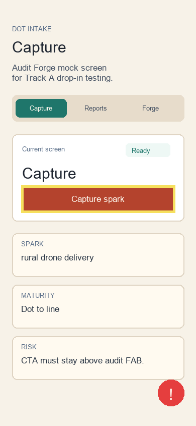

# Audit Report: Capture CTA



## Screen

Capture

## Customer Note

The primary "Capture spark" action is the only thing I need on the first pass. It should stay visually dominant even with the audit FAB mounted near the bottom-right corner.

## Selection Bounds

```json
{ "x": 42, "y": 367, "width": 306, "height": 54 }
```

## Agent Input

READ the Capture screen. LOCATE the primary CTA styling. HYPOTHESIZE that the rust button and audit FAB can coexist if the CTA keeps a stable height and enough bottom padding. REPAIR only the Capture surface if needed. TEST with `npm run typecheck` and `npx expo install --check`. VERIFY `AuditWidget` is still mounted once in the root layout.
