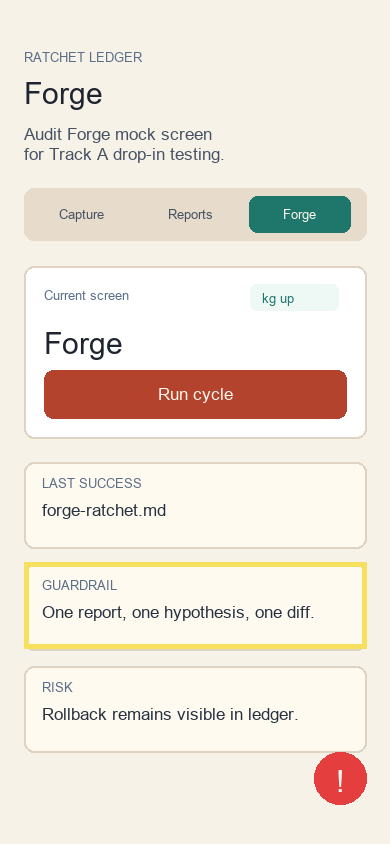

# Audit Report: Forge Ratchet



## Screen

Forge

## Customer Note

The rollback cycle must be visible in the same ledger as successful fixes. If failed hypotheses disappear, the ratchet story becomes less trustworthy.

## Selection Bounds

```json
{ "x": 24, "y": 562, "width": 342, "height": 86 }
```

## Agent Input

READ `FORGE.md`. LOCATE the cycle table. HYPOTHESIZE that one explicit rollback row plus increasing kg values makes the loop auditable. REPAIR the ledger, not the app architecture. TEST with `rg -n "success|rollback" FORGE.md` and `npm run typecheck`. VERIFY changed files stay under the submission folder.
