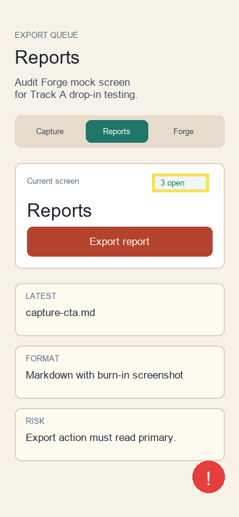

# Audit Report: Reports Export



## Screen

Reports

## Customer Note

The report queue should make export status scannable. The small status pill is useful, but the copy must not imply that real user data is included in the audit package.

## Selection Bounds

```json
{ "x": 248, "y": 283, "width": 92, "height": 30 }
```

## Agent Input

READ the Reports screen and the README evidence section. LOCATE status text and report export language. HYPOTHESIZE that mock-data wording reduces privacy risk without adding UI complexity. REPAIR copy only. TEST with `npm run typecheck`. VERIFY the audit reports still contain burn-in screenshots, screen names, customer notes, bounds and this agent input section.
