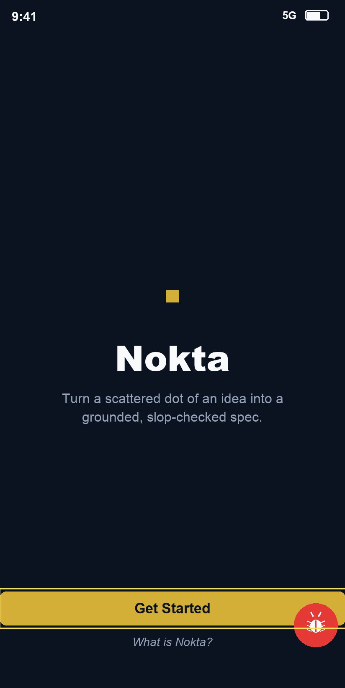

# Bug Raporu — Nokta

**Tarih:** 18.05.2026 21:14
**Toplam:** 1 not · 🔴 1 açık · ✅ 0 düzeltildi
**Kaynak:** nokta-audit (`@xtatistix/mobile-audit`) → Markdown export

> Burn-in'li ekran görüntüsü (sarı seçim kutusu görüntünün immutable parçasıdır).

---

## Ekran: OnboardingScreen

### 🔴 #1 — "Get Started" butonu ekranın iki kenarına da yapışık duruyor

Ana ekrandaki sarı "Get Started" butonu soldan ve sağdan ekran kenarına kadar
uzanıyor, hiç boşluk yok. Telefonda kırık / yarım çizilmiş gibi görünüyor.
Kenarlardan biraz içeride dursa çok daha düzgün olur.

- **Durum:** Açık
- **Seçim (burn-in bounds):** `{ x: 0, y: 1410, width: 824, height: 80 }`
- **Zaman:** 18.05.2026 21:14
- **Raporlayan:** qa-team
- **currentScreen:** `OnboardingScreen` → `src/app/index.tsx`
