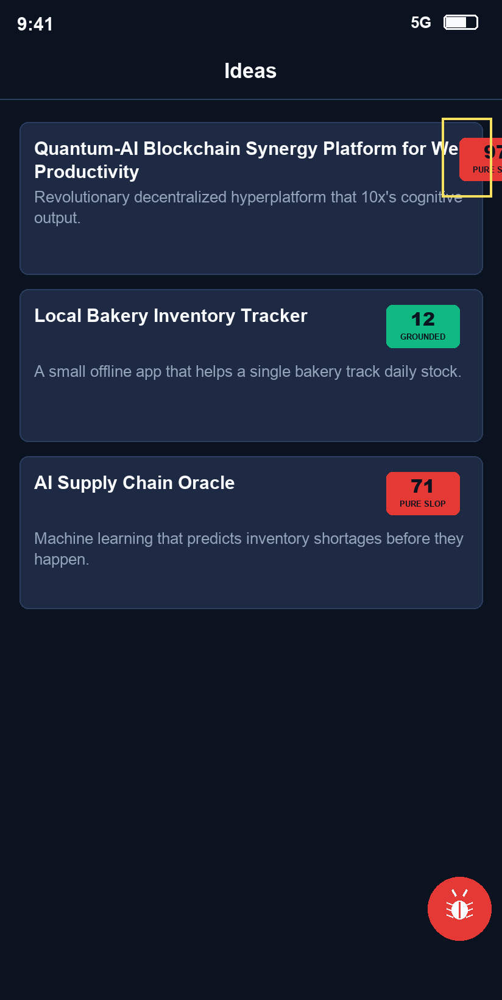

# Bug Raporu — Nokta

**Tarih:** 18.05.2026 21:19
**Toplam:** 1 not · 🔴 1 açık · ✅ 0 düzeltildi
**Kaynak:** nokta-audit (`@xtatistix/mobile-audit`) → Markdown export

> Burn-in'li ekran görüntüsü (sarı seçim kutusu görüntünün immutable parçasıdır).

---

## Ekran: IdeaListScreen

### 🔴 #1 — Uzun başlıkta slop skor rozeti ekranın sağ kenarından taşıyor

İlk karttaki başlık ("Quantum-AI Blockchain Synergy Platform for Web4
Productivity") çok uzun olduğu için skor rozetini (97 / PURE SLOP) sağ kenarın
dışına itiyor; rozetin yarısı kesiliyor ve okunmuyor. Kısa başlıklı kartlarda
(Local Bakery, AI Supply Chain) rozet düzgün duruyor — sorun yalnızca uzun
başlıkta. Başlık tek/iki satıra sığsa ve rozet sabit kalsa iyi olur.

- **Durum:** Açık
- **Seçim (burn-in bounds):** `{ x: 728, y: 196, width: 76, height: 124 }`
- **Zaman:** 18.05.2026 21:19
- **Raporlayan:** qa-team
- **currentScreen:** `IdeaListScreen` → `src/app/ideas/index.tsx`
