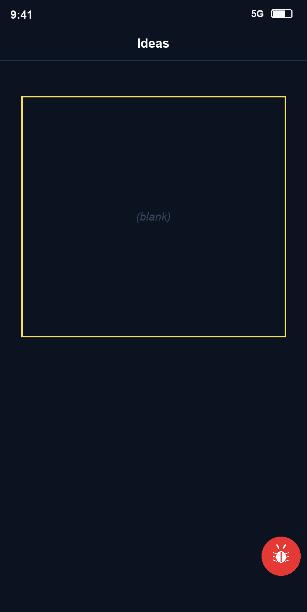

# Bug Raporu — Nokta

**Tarih:** 18.05.2026 21:33
**Toplam:** 1 not · 🔴 1 açık · ✅ 0 düzeltildi
**Kaynak:** nokta-audit (`@xtatistix/mobile-audit`) → Markdown export

> Bu bir stil bug'ı değil, **feature request** (müşteri-geliştirici notu).

---

## Ekran: IdeaListScreen

### 🔴 #1 — Liste boşken ekran tamamen boş kalıyor (buraya bir şey yazsa güzel olurdu)

Test sırasında mock veriyi temizleyip listeyi boş bıraktım ve ekranda hiçbir şey
kalmadı — sadece koca bir boşluk. Kullanıcı "uygulama bozuldu mu?" diye düşünür.
Burada "Henüz fikir yok, ilk noktanı ekle" gibi dostça bir boş-durum mesajı + bir
çağrı butonu olsa çok daha iyi olurdu. (Müşteri olarak fark ettim; geliştirici
gibi davranıp sisteme veriyorum.)

- **Durum:** Açık
- **Niyet (intent):** feature request — empty state
- **Seçim (burn-in bounds):** `{ x: 60, y: 260, width: 704, height: 640 }`
- **Zaman:** 18.05.2026 21:33
- **Raporlayan:** qa-team
- **currentScreen:** `IdeaListScreen` → `src/app/ideas/index.tsx`
